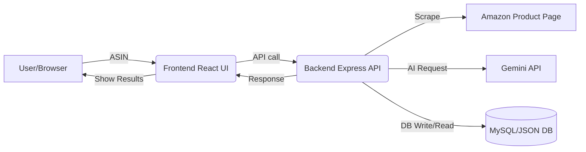

<!-- Badges -->
<p align="center">
	
	
	
	
</p>


# Amazon Listing Optimizer

A full-stack application that takes an Amazon ASIN, fetches the product details directly from the product page, and generates optimized listing content using Google Gemini. The app displays original and optimized content side-by-side and keeps a history of every optimization.

This README explains what the project does, how it is structured, and how to run it locally.

---

## Screenshots

<p align="center">
	
	
	
</p>

---

## Features

- Fetches Amazon product data using a custom scraper (title, bullet points, description, image).
- Uses Gemini 2.5 Flash to generate improved titles, bullets, descriptions, and keyword suggestions.
- Stores every optimization in a MySQL database.
- Clean React frontend for entering ASINs, comparing results, and viewing history.
- Modern, minimal UI.

---

## Tech Stack

### Backend
- Node.js + Express
- Sequelize (MySQL)
- Axios + Cheerio for scraping
- Custom Gemini API client

### Frontend
- React + Vite

---


## Architecture Overview

The system follows a simple client-server flow:
1. User enters an ASIN in the frontend.
2. Frontend calls the backend /api/optimize endpoint.
3. Backend scrapes Amazon for title, bullets, description, and image.
4. Gemini generates optimized content.
5. Backend stores all data and returns it to the UI.
6. UI shows a comparison and stores the state for reload.
7. /api/history provides all past optimizations.

---

## System Diagram



---

## Why This Project Matters
This project demonstrates practical skills used in e-commerce automation: structured scraping, AI-based content generation, secure API design, data persistence, and clean UI workflows. It simulates a simplified version of internal tools used by Amazon sellers and retail optimization teams.

---

## Backend Setup

1. Go to the backend folder
	```sh
	cd backend
	```
2. Install dependencies
	```sh
	npm install
	```
3. Create a .env file
	```sh
	cp .env.example .env
	```
4. Fill in required fields in `.env`:
	```env
	PORT=3000
	GEMINI_API_KEY=your_key_here
	GEMINI_MODEL=gemini-2.5-flash
	DB_HOST=localhost
	DB_USER=your_mysql_user
	DB_PASS=your_mysql_pass
	DB_NAME=listing_optimizer
	```
	If MySQL credentials are valid, the backend will create tables automatically.
5. Start the backend
	```sh
	npm run dev
	```
	Backend will run at:
	http://localhost:3000

---

## Frontend Setup

1. Go to the frontend folder
	```sh
	cd frontend
	```
2. Install dependencies
	```sh
	npm install
	```
3. Start the UI
	```sh
	npm run dev
	```
	Vite will show you a local development URL, usually:
	http://localhost:5173

---


## How to Use the App

1. Open the frontend in the browser.
2. Enter a valid Amazon ASIN.
3. Click Optimize.
4. The UI will show:
	- Original title, bullets, description, and image.
	- Optimized title, bullets, description, and keywords.
5. Visit the History section to view all past optimizations.


---


## API Summary

**POST** `/api/optimize`

Input:
```json
{ "asin": "B0FWDBH2T2" }
```
Returns scraped data + optimized data.

**GET** `/api/history`

Returns all stored optimizations.

**GET** `/api/history/:asin`

Returns optimization history for one ASIN.


---


---

## Engineering Decisions

- Used localStorage so users don’t lose results on reload.
- Scraper has fallback selectors for Amazon layout changes.
- AI output schema is always the same for the frontend.
- There’s a JSON fallback DB mode if MySQL isn’t available.
- Broke out scraper, AI client, and DB helpers into separate modules.

---

## Limitations

- Amazon changes their HTML often, so scraping can break.
- If you scrape too fast, Amazon might block you.
- Gemini’s output isn’t always consistent; prompt tweaks help but don’t fix everything.

---

<p align="center">
	<b>Made by Aditya Goyal</b><br>
	<a href="mailto:adityism@gmail.com">Contact: adityism@gmail.com</a>
</p>